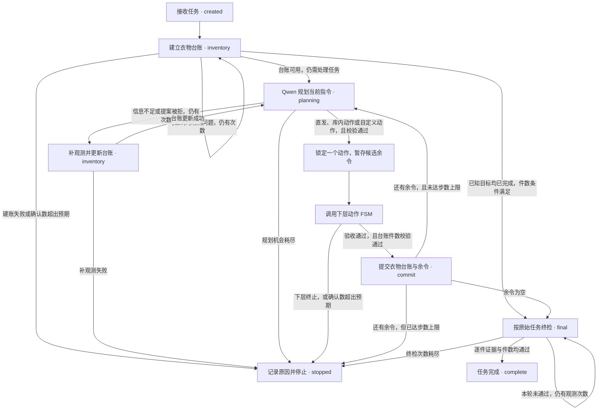
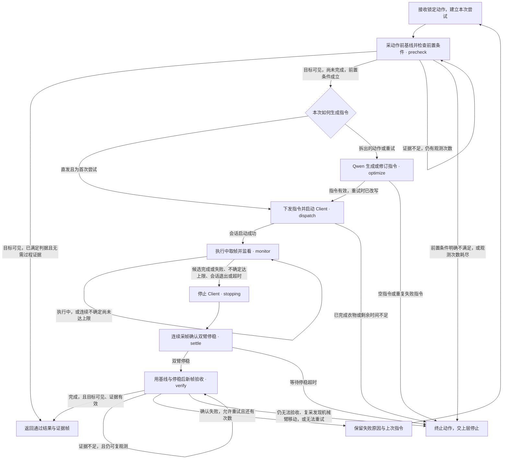

# EX001 两层 FSM 架构

## 上层任务 FSM

```mermaid
flowchart TD
    Created["接收任务 · created"] --> Inventory["建立衣物台账 · inventory"]
    Inventory -->|"已知目标均已完成，件数条件满足"| Final["按原始任务终检 · final"]
    Inventory -->|"台账可用，仍需处理任务"| Plan["Qwen 规划当前指令 · planning"]
    Inventory -->|"可重试的观测问题，仍有次数"| Inventory
    Inventory -->|"建账失败或确认数超出预期"| Stopped["记录原因并停止 · stopped"]

    Plan -->|"直发、库内动作或自定义动作，且校验通过"| Lock["锁定一个动作，暂存候选余令"]
    Plan -->|"信息不足或提案被拒，仍有次数"| Refresh["补观测并更新台账 · inventory"]
    Refresh -->|"台账更新成功"| Plan
    Refresh -->|"补观测失败"| Stopped
    Plan -->|"规划机会耗尽"| Stopped

    Lock --> Action["调用下层动作 FSM"]
    Action -->|"验收通过，且台账件数校验通过"| Commit["提交衣物台账与余令 · commit"]
    Action -->|"下层终止，或确认数超出预期"| Stopped
    Commit -->|"还有余令，且未达步数上限"| Plan
    Commit -->|"还有余令，但已达步数上限"| Stopped
    Commit -->|"余令为空"| Final
    Final -->|"逐件证据与件数均通过"| Complete["任务完成 · complete"]
    Final -->|"本轮未通过，仍有观测次数"| Final
    Final -->|"终检次数耗尽"| Stopped
```

## 下层动作 FSM

```mermaid
flowchart TD
    Start["接收锁定动作，建立本次尝试"] --> Precheck["采动作前基线并检查前置条件 · precheck"]
    Precheck -->|"目标可见，已满足判据且无需过程证据"| Passed["返回通过结果与证据帧"]
    Precheck -->|"目标可见，尚未完成，前置条件成立"| Instruction{"本次如何生成指令"}
    Precheck -->|"证据不足，仍有观测次数"| Precheck
    Precheck -->|"前置条件明确不满足，或观测次数耗尽"| Halt["终止动作，交上层停止"]

    Instruction -->|"直发且为首次尝试"| Dispatch["下发指令并启动 Client · dispatch"]
    Instruction -->|"拆出的动作或重试"| Optimize["Qwen 生成或修订指令 · optimize"]
    Optimize -->|"指令有效，重试时已改写"| Dispatch
    Optimize -->|"空指令或重复失败指令"| Halt

    Dispatch -->|"会话启动成功"| Monitor["执行中取帧并监看 · monitor"]
    Dispatch -->|"已完成衣物或剩余时间不足"| Halt
    Monitor -->|"执行中，或连续不确定尚未达上限"| Monitor
    Monitor -->|"候选完成或失败、不确定达上限、会话退出或超时"| StopClient["停止 Client · stopping"]
    StopClient --> Settle["连续采帧确认双臂停稳 · settle"]
    Settle -->|"双臂停稳"| Verify["用基线与停稳后新帧验收 · verify"]
    Settle -->|"等待停稳超时"| Halt

    Verify -->|"完成，且目标可见、证据有效"| Passed
    Verify -->|"证据不足，且仍可复观测"| Verify
    Verify -->|"确认失败，允许重试且还有次数"| Retry["保留失败原因与上次指令"]
    Retry --> Start
    Verify -->|"仍无法验收、复采发现机械臂移动，或无法重试"| Halt
```
