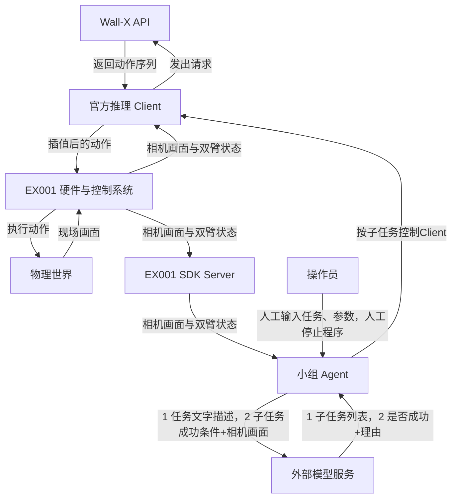

# EX001 当前架构

```mermaid
flowchart TD
    WallX["Wall-X API"]
    Client["官方推理 Client"]
    Robot["EX001 硬件与控制系统"]
    World["物理世界"]
    Model["外部模型服务"]
    Agent["小组 Agent"]
    SDK["EX001 SDK Server"]
    User["操作员"]

    Client -->|"发出请求"| WallX
    WallX -->|"返回动作序列"| Client
    Robot -->|"相机画面与双臂状态"| Client
    Client -->|"插值后的动作"| Robot
    Robot -->|"执行动作"| World
    World -->|"现场画面"| Robot

    Agent -->|"按子任务控制Client"| Client
    Agent -->|"1 任务文字描述，2 子任务成功条件+相机画面"| Model
    Model -->|"1 子任务列表，2 是否成功+理由"| Agent
    Robot -->|"相机画面与双臂状态"| SDK
    SDK -->|"相机画面与双臂状态"| Agent
    User -->|"人工输入任务、参数，人工停止程序"| Agent
```
